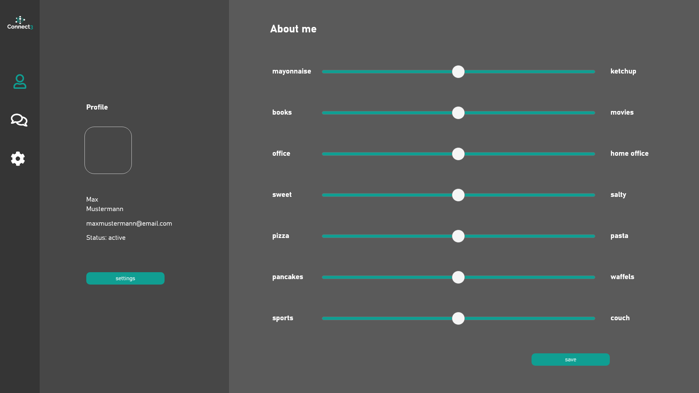

# Connect3
Socket based Chat Application

## Table of contents
* [General info](#general-info)
* [Screenshots](#screenshots)
* [Technologies](#technologies)
* [Setup](#setup)
* [Features](#features)
* [Status](#status)

## General info
Chat Application designed during msg Code & Create event 2020.

## Screenshots

## Technologies
* JavaFX
* Maven
* [Tray Notifications](https://github.com/PlusHaze/TrayNotification)

## Setup
Describe how to install / setup your local environement / add link to demo version.

## Features
List of features ready and TODOs for future development
* Basic Chat functionality (Server-Chats)
* Dark Mode by default

To-do list:
* matching feature
* Server Commands

## Status
Project is _in progress_
